# Introduction

This document will walk you through the implementation of the COBOL program <SwmPath>[app/cbl/CBACT01C.cbl](/app/cbl/CBACT01C.cbl)</SwmPath> in the <SwmToken path="/app/cbl/CBACT01C.cbl" pos="3:7:7" line-data="      * Application : CardDemo                                          ">`CardDemo`</SwmToken> application. The program reads and prints account data from a file.

We will cover:

1. File handling and structure.
2. Main program workflow.
3. Error handling and status display.

# File handling and structure

<SwmSnippet path="/app/cbl/CBACT01C.cbl" line="26">

---

The program starts by defining the file control and structure. The file is indexed and accessed sequentially.

```
       ENVIRONMENT DIVISION.                                                    
       INPUT-OUTPUT SECTION.                                                    
       FILE-CONTROL.                                                            
           SELECT ACCTFILE-FILE ASSIGN TO ACCTFILE                              
                  ORGANIZATION IS INDEXED                                       
                  ACCESS MODE  IS SEQUENTIAL                                    
                  RECORD KEY   IS FD-ACCT-ID                                    
                  FILE STATUS  IS ACCTFILE-STATUS.                              
```

---

</SwmSnippet>

<SwmSnippet path="/app/cbl/CBACT01C.cbl" line="34">

---

The file structure is defined in the data division. The account file contains an account ID and account data.

```
      *                                                                         
       DATA DIVISION.                                                           
       FILE SECTION.                                                            
       FD  ACCTFILE-FILE.                                                       
       01  FD-ACCTFILE-REC.                                                     
           05 FD-ACCT-ID                        PIC 9(11).                      
           05 FD-ACCT-DATA                      PIC X(289).                     
```

---

</SwmSnippet>

# Working storage

<SwmSnippet path="/app/cbl/CBACT01C.cbl" line="42">

---

The working storage section includes various status fields and binary values used throughout the program.

```
       WORKING-STORAGE SECTION.                                                 
                                                                                
      *****************************************************************         
       COPY CVACT01Y.                                                           
       01  ACCTFILE-STATUS.                                                     
           05  ACCTFILE-STAT1      PIC X.                                       
           05  ACCTFILE-STAT2      PIC X.                                       
```

---

</SwmSnippet>

<SwmSnippet path="/app/cbl/CBACT01C.cbl" line="50">

---

```
       01  IO-STATUS.                                                           
           05  IO-STAT1            PIC X.                                       
           05  IO-STAT2            PIC X.                                       
       01  TWO-BYTES-BINARY        PIC 9(4) BINARY.                             
       01  TWO-BYTES-ALPHA         REDEFINES TWO-BYTES-BINARY.                  
           05  TWO-BYTES-LEFT      PIC X.                                       
           05  TWO-BYTES-RIGHT     PIC X.                                       
       01  IO-STATUS-04.                                                        
           05  IO-STATUS-0401      PIC 9   VALUE 0.                             
           05  IO-STATUS-0403      PIC 999 VALUE 0.                             
```

---

</SwmSnippet>

<SwmSnippet path="/app/cbl/CBACT01C.cbl" line="61">

---

```
       01  APPL-RESULT             PIC S9(9)   COMP.                            
           88  APPL-AOK            VALUE 0.                                     
           88  APPL-EOF            VALUE 16.                                    
                                                                                
       01  END-OF-FILE             PIC X(01)    VALUE 'N'.                      
       01  ABCODE                  PIC S9(9) BINARY.                            
       01  TIMING                  PIC S9(9) BINARY.                            
```

---

</SwmSnippet>

# Main program workflow

<SwmSnippet path="/app/cbl/CBACT01C.cbl" line="69">

---

The procedure division contains the main logic of the program. It starts by displaying a start message and opening the account file.

```
      *****************************************************************         
       PROCEDURE DIVISION.                                                      
           DISPLAY 'START OF EXECUTION OF PROGRAM CBACT01C'.                    
           PERFORM 0000-ACCTFILE-OPEN.                                          
                                                                                
           PERFORM UNTIL END-OF-FILE = 'Y'                                      
               IF  END-OF-FILE = 'N'                                            
                   PERFORM 1000-ACCTFILE-GET-NEXT                               
                   IF  END-OF-FILE = 'N'                                        
                       DISPLAY ACCOUNT-RECORD                                   
                   END-IF                                                       
               END-IF                                                           
           END-PERFORM.                                                         
```

---

</SwmSnippet>

<SwmSnippet path="/app/cbl/CBACT01C.cbl" line="89">

---

The program reads the account file in a loop until the end of the file is reached. If an account record is successfully read, it is displayed.

```
      *****************************************************************         
      * I/O ROUTINES TO ACCESS A KSDS, VSAM DATA SET...               *         
      *****************************************************************         
       1000-ACCTFILE-GET-NEXT.                                                  
           READ ACCTFILE-FILE INTO ACCOUNT-RECORD.                              
           IF  ACCTFILE-STATUS = '00'                                           
               MOVE 0 TO APPL-RESULT                                            
               PERFORM 1100-DISPLAY-ACCT-RECORD                                 
           ELSE                                                                 
               IF  ACCTFILE-STATUS = '10'                                       
                   MOVE 16 TO APPL-RESULT                                       
               ELSE                                                             
                   MOVE 12 TO APPL-RESULT                                       
               END-IF                                                           
           END-IF                                                               
           IF  APPL-AOK                                                         
               CONTINUE                                                         
           ELSE                                                                 
               IF  APPL-EOF                                                     
                   MOVE 'Y' TO END-OF-FILE                                      
               ELSE                                                             
                   DISPLAY 'ERROR READING ACCOUNT FILE'                         
                   MOVE ACCTFILE-STATUS TO IO-STATUS                            
                   PERFORM 9910-DISPLAY-IO-STATUS                               
                   PERFORM 9999-ABEND-PROGRAM                                   
               END-IF                                                           
           END-IF                                                               
           EXIT.                                                                
      *---------------------------------------------------------------*         
       1100-DISPLAY-ACCT-RECORD.                                                
```

---

</SwmSnippet>

<SwmSnippet path="/app/cbl/CBACT01C.cbl" line="119">

---

The account record details are displayed in a formatted manner.

```
           DISPLAY 'ACCT-ID                 :'   ACCT-ID                        
           DISPLAY 'ACCT-ACTIVE-STATUS      :'   ACCT-ACTIVE-STATUS             
           DISPLAY 'ACCT-CURR-BAL           :'   ACCT-CURR-BAL                  
           DISPLAY 'ACCT-CREDIT-LIMIT       :'   ACCT-CREDIT-LIMIT              
           DISPLAY 'ACCT-CASH-CREDIT-LIMIT  :'   ACCT-CASH-CREDIT-LIMIT         
           DISPLAY 'ACCT-OPEN-DATE          :'   ACCT-OPEN-DATE                 
           DISPLAY 'ACCT-EXPIRAION-DATE     :'   ACCT-EXPIRAION-DATE            
           DISPLAY 'ACCT-REISSUE-DATE       :'   ACCT-REISSUE-DATE              
           DISPLAY 'ACCT-CURR-CYC-CREDIT    :'   ACCT-CURR-CYC-CREDIT           
           DISPLAY 'ACCT-CURR-CYC-DEBIT     :'   ACCT-CURR-CYC-DEBIT            
           DISPLAY 'ACCT-GROUP-ID           :'   ACCT-GROUP-ID                  
           DISPLAY '-------------------------------------------------'          
           EXIT.                                                                
```

---

</SwmSnippet>

<SwmSnippet path="/app/cbl/CBACT01C.cbl" line="83">

---

Finally, the program closes the account file and displays an end message.

```
           PERFORM 9000-ACCTFILE-CLOSE.                                         
                                                                                
           DISPLAY 'END OF EXECUTION OF PROGRAM CBACT01C'.                      
                                                                                
           GOBACK.                                                              
```

---

</SwmSnippet>

# Error handling and status display

<SwmSnippet path="/app/cbl/CBACT01C.cbl" line="132">

---

The program includes routines for opening and closing the account file, with error handling for each operation.

```
      *---------------------------------------------------------------*         
       0000-ACCTFILE-OPEN.                                                      
           MOVE 8 TO APPL-RESULT.                                               
           OPEN INPUT ACCTFILE-FILE                                             
           IF  ACCTFILE-STATUS = '00'                                           
               MOVE 0 TO APPL-RESULT                                            
           ELSE                                                                 
               MOVE 12 TO APPL-RESULT                                           
           END-IF                                                               
           IF  APPL-AOK                                                         
               CONTINUE                                                         
           ELSE                                                                 
               DISPLAY 'ERROR OPENING ACCTFILE'                                 
               MOVE ACCTFILE-STATUS TO IO-STATUS                                
               PERFORM 9910-DISPLAY-IO-STATUS                                   
               PERFORM 9999-ABEND-PROGRAM                                       
           END-IF                                                               
           EXIT.                                                                
      *---------------------------------------------------------------*         
       9000-ACCTFILE-CLOSE.                                                     
           ADD 8 TO ZERO GIVING APPL-RESULT.                                    
           CLOSE ACCTFILE-FILE                                                  
           IF  ACCTFILE-STATUS = '00'                                           
               SUBTRACT APPL-RESULT FROM APPL-RESULT                            
           ELSE                                                                 
               ADD 12 TO ZERO GIVING APPL-RESULT                                
           END-IF                                                               
           IF  APPL-AOK                                                         
               CONTINUE                                                         
           ELSE                                                                 
               DISPLAY 'ERROR CLOSING ACCOUNT FILE'                             
               MOVE ACCTFILE-STATUS TO IO-STATUS                                
               PERFORM 9910-DISPLAY-IO-STATUS                                   
               PERFORM 9999-ABEND-PROGRAM                                       
           END-IF                                                               
           EXIT.                                                                
```

---

</SwmSnippet>

<SwmSnippet path="/app/cbl/CBACT01C.cbl" line="169">

---

If an error occurs while reading the account file, the program displays the <SwmToken path="/app/cbl/CBACT01C.cbl" pos="90:3:5" line-data="      * I/O ROUTINES TO ACCESS A KSDS, VSAM DATA SET...               *         ">`I/O`</SwmToken> status and abends.

```
       9999-ABEND-PROGRAM.                                                      
           DISPLAY 'ABENDING PROGRAM'                                           
           MOVE 0 TO TIMING                                                     
           MOVE 999 TO ABCODE                                                   
           CALL 'CEE3ABD'.                                                      
```

---

</SwmSnippet>

<SwmSnippet path="/app/cbl/CBACT01C.cbl" line="175">

---

```
      *****************************************************************         
       9910-DISPLAY-IO-STATUS.                                                  
           IF  IO-STATUS NOT NUMERIC                                            
           OR  IO-STAT1 = '9'                                                   
               MOVE IO-STAT1 TO IO-STATUS-04(1:1)                               
               MOVE 0        TO TWO-BYTES-BINARY                                
               MOVE IO-STAT2 TO TWO-BYTES-RIGHT                                 
               MOVE TWO-BYTES-BINARY TO IO-STATUS-0403                          
               DISPLAY 'FILE STATUS IS: NNNN' IO-STATUS-04                      
           ELSE                                                                 
               MOVE '0000' TO IO-STATUS-04                                      
               MOVE IO-STATUS TO IO-STATUS-04(3:2)                              
               DISPLAY 'FILE STATUS IS: NNNN' IO-STATUS-04                      
           END-IF                                                               
           EXIT.                                                                
```

---

</SwmSnippet>

# Diagram

```mermaid
sequenceDiagram
    participant Program
    participant AccountFile

    rect rgb(191, 223, 255)
    note right of Program: Program starts and opens the account file.
    Program->>+AccountFile: OPEN INPUT ACCTFILE-FILE
    AccountFile-->>-Program: Status
    end

    rect rgb(200, 150, 255)
    note right of Program: Program reads account records until EOF.
    loop Until EOF
        Program->>+AccountFile: READ ACCTFILE-FILE
        AccountFile-->>-Program: Account Record
        alt Record Found
            Program->>Program: DISPLAY ACCOUNT-RECORD
        else EOF
            Program->>Program: MOVE 'Y' TO END-OF-FILE
        end
    end
    end

    rect rgb(191, 223, 255)
    note right of Program: Program closes the account file and ends.
    Program->>+AccountFile: CLOSE ACCTFILE-FILE
    AccountFile-->>-Program: Status
    Program->>Program: DISPLAY 'END OF EXECUTION'
    end

%% Swimm:
%% sequenceDiagram
%%     participant Program
%%     participant AccountFile
%% 
%%     rect rgb(191, 223, 255)
%%     note right of Program: Program starts and opens the account file.
%%     Program->>+AccountFile: OPEN INPUT <SwmToken path="/app/cbl/CBACT01C.cbl" pos="29:3:5" line-data="           SELECT ACCTFILE-FILE ASSIGN TO ACCTFILE                              ">`ACCTFILE-FILE`</SwmToken>
%%     AccountFile-->>-Program: Status
%%     end
%% 
%%     rect rgb(200, 150, 255)
%%     note right of Program: Program reads account records until EOF.
%%     loop Until EOF
%%         Program->>+AccountFile: READ <SwmToken path="/app/cbl/CBACT01C.cbl" pos="29:3:5" line-data="           SELECT ACCTFILE-FILE ASSIGN TO ACCTFILE                              ">`ACCTFILE-FILE`</SwmToken>
%%         AccountFile-->>-Program: Account Record
%%         alt Record Found
%%             Program->>Program: DISPLAY <SwmToken path="/app/cbl/CBACT01C.cbl" pos="78:3:5" line-data="                       DISPLAY ACCOUNT-RECORD                                   ">`ACCOUNT-RECORD`</SwmToken>
%%         else EOF
%%             Program->>Program: MOVE 'Y' TO <SwmToken path="/app/cbl/CBACT01C.cbl" pos="65:3:7" line-data="       01  END-OF-FILE             PIC X(01)    VALUE &#39;N&#39;.                      ">`END-OF-FILE`</SwmToken>
%%         end
%%     end
%%     end
%% 
%%     rect rgb(191, 223, 255)
%%     note right of Program: Program closes the account file and ends.
%%     Program->>+AccountFile: CLOSE <SwmToken path="/app/cbl/CBACT01C.cbl" pos="29:3:5" line-data="           SELECT ACCTFILE-FILE ASSIGN TO ACCTFILE                              ">`ACCTFILE-FILE`</SwmToken>
%%     AccountFile-->>-Program: Status
%%     Program->>Program: DISPLAY 'END OF EXECUTION'
%%     end
```



<SwmMeta version="3.0.0" repo-id="Z2l0aHViJTNBJTNBYXdzLW1haW5mcmFtZS1tb2Rlcm5pemF0aW9uLWNhcmRkZW1vJTNBJTNBdmFsZGVjaXJjYXJ2YWxobw==" repo-name="aws-mainframe-modernization-carddemo"><sup>Powered by [Swimm](https://app.swimm.io/)</sup></SwmMeta>
